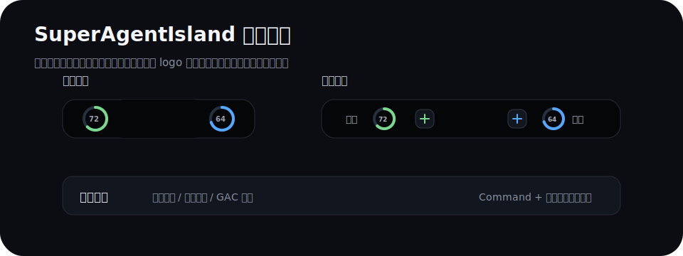
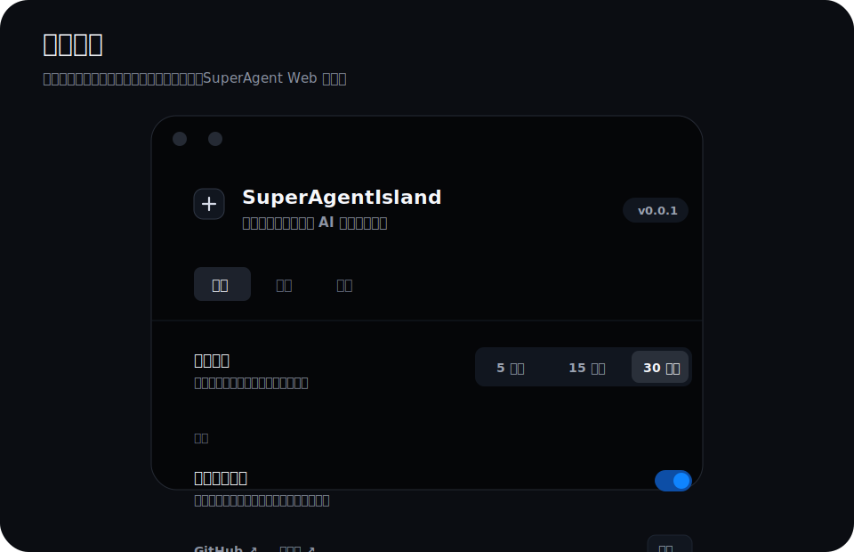

# SuperAgentIsland

SuperAgentIsland 是一个 macOS 菜单栏岛屿应用，用来查看内部 SuperAgent 用量和 GAC 积分状态。应用常驻在 MacBook 刘海 / 菜单栏附近，缩小时展示两个关键百分比，悬停和点击后展开完整面板。

> 本项目基于 [ericjypark/codex-island](https://github.com/ericjypark/codex-island) 做内部场景改造；当前仓库保留干净的公司维护历史，并在这里保留上游致谢。

## 功能概览

- 查看 SuperAgent 当日额度、剩余额度、调用次数、Token、预估费用和已结算费用。
- 查看不同时间范围的模型调用排行：今日、近 7 天、近 30 天、全部。
- 查看两个 GAC 账号的积分剩余量，并判断今天是否已经发起过重置。
- 自动刷新用量数据，刷新间隔可选 5 / 15 / 30 分钟。
- 支持 Sparkle 自动更新，发布包通过 GitHub Release 分发。

## 界面截图

### 岛屿概览



### 设置面板



## 安装

1. 打开 [Releases](https://github.com/daodaolee/super-agent-island/releases)。
2. 下载最新版本的 `SuperAgentIsland-<version>.dmg`。
3. 打开 DMG，把 `SuperAgentIsland.app` 拖到 `Applications`。
4. 第一次启动时，如果 macOS 提示来源确认，按公司内部安装规范允许打开。

## 使用说明

### 1. 缩小状态

应用启动后会停留在菜单栏岛屿区域：

- 左侧圆环：SuperAgent 今日剩余额度百分比。
- 右侧圆环：GAC 总积分剩余百分比。
- 圆环会跟随后台刷新结果自动更新。

### 2. 悬停查看提示

鼠标悬停到岛屿上后会变宽：

- 左侧展示 `额度` 文案和剩余额度圆环。
- 右侧展示积分圆环和 `积分` 文案。
- 此状态只做快速提示，不会打开完整面板。

### 3. 点击展开面板

点击岛屿后进入完整面板，左右切换三个页面：

1. **用量概览**：额度、趋势、调用次数、Token、预估费用、结算费用。
2. **模型排行**：按当前时间范围展示用量最高的前 4 个模型。
3. **GAC 积分**：展示两个账号剩余积分和今天是否已重置。

按住 `Command` 点击岛屿，可以切换当前统计范围：今日 → 近 7 天 → 近 30 天 → 全部。

### 4. 设置

点击展开面板左下角的设置按钮，可以打开设置窗口。

通用：

- 开机自动启动。
- 刷新间隔。
- 自动检查更新。
- 立即检查更新。

显示：

- 低功耗模式。开启后只在刷新时显示蓝色光效。

账号：

- SuperAgent Web 登录账号。
- SuperAgent Web 登录密码。
- 测试账号密码是否可用。
- 手动刷新 SuperAgent 数据。

## 自动更新

应用使用 Sparkle 检查更新，更新源为：

```text
https://github.com/daodaolee/super-agent-island/releases/latest/download/appcast.xml
```

如果还没有发布 GitHub Release，设置里的“立即检查”会显示中文提示，不会弹出 Sparkle 的英文错误窗。

## 开发维护

更多架构、数据结构、设置项和发布说明见 [docs/PROJECT_OVERVIEW.md](docs/PROJECT_OVERVIEW.md)。

常用命令：

```bash
# 构建本地 App
CLANG_MODULE_CACHE_PATH=/tmp/swift-module-cache ./build.sh

# 打包 DMG 和 appcast
CLANG_MODULE_CACHE_PATH=/tmp/swift-module-cache ./release.sh

# 本地一键发布：构建、推送 main/tag、上传 GitHub Release 资产
CLANG_MODULE_CACHE_PATH=/tmp/swift-module-cache ./scripts/publish-release.sh
```

真实账号密码不提交到 git。发布构建会从本地配置读取并注入：

```text
~/.super-agent-island/release-secrets.env
```

模板见 [.release-secrets.env.example](.release-secrets.env.example)。

## AI 开发工作流

收到新需求时先看 [WORKFLOW.md](WORKFLOW.md)。核心约定：

- 小 bug / 文案 / 样式微调：直接改，跑构建和验收清单。
- 新功能 / 新页面 / 新数据源：先写变更说明和 BDD 场景，再实现。
- 每次 release 前按 [acceptance/checklist.md](acceptance/checklist.md) 做人工验收。

## License

MIT. See [LICENSE](LICENSE).
